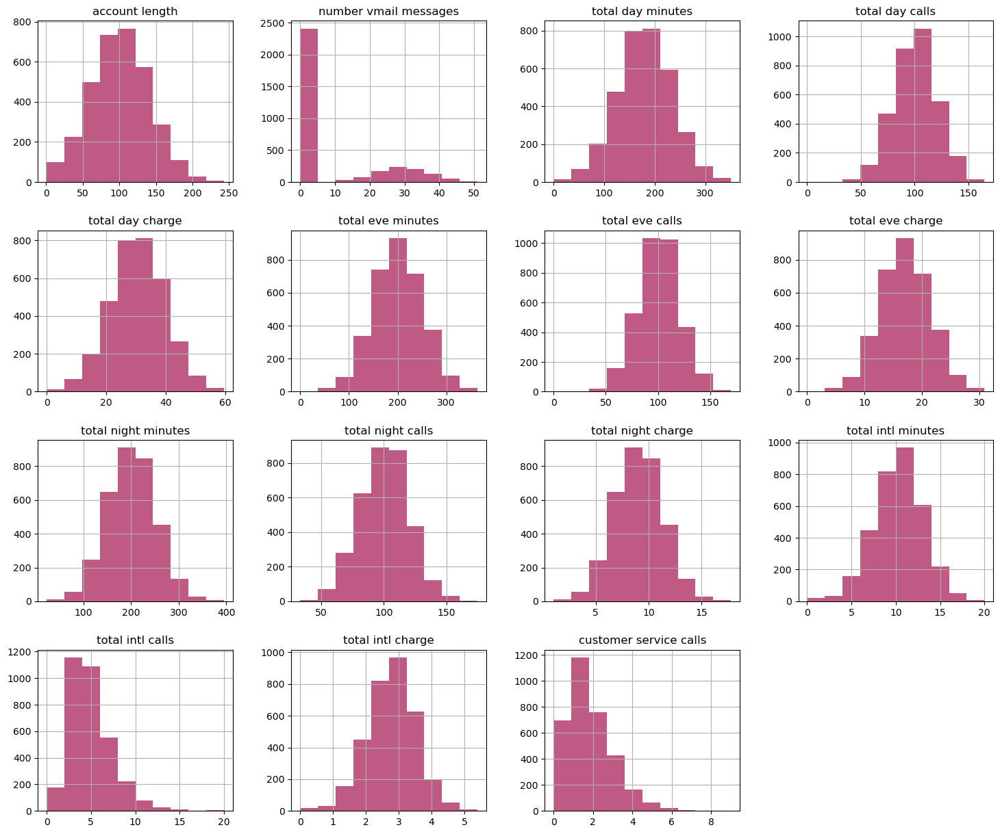

# 
Predicting Customer Retention For SyriaTel Mobile Telecom

### Overview

Customer churn has emerged as a critical concern for companies like SyriaTel in the fiercely competitive telecommunications industry. With customers having numerous options and increasing expectations, retaining existing customers has become paramount. 
Churn not only leads to immediate revenue loss but also exerts significant pressure on customer acquisition costs. Understanding the factors that contribute to churn and being able to predict it with accuracy is crucial for telecom businesses to develop effective retention strategies. By analyzing historical customer data, telecom companies can gain valuable insights into customer behavior, preferences, and interactions, enabling them to identify potential churners and tailor retention efforts accordingly and proactively.
This proactive approach minimizes revenue loss and enhances customer satisfaction, loyalty, and overall business performance.

### Business Understanding

The main objective of SyriaTel is to provide high-quality telecommunications services to its customers and grow its market share. This includes increasing revenue, profits, and customer satisfaction. However, in order to achieve these goals, the company needs to ensure that its customers remain loyal and do not churn.

The main objective of this churn prediction project is to help SyriaTel identify potential churners and take proactive measures to retain them. The project aims to build a predictive model that can identify customers who are likely to churn, based on their past behavior and usage patterns. This will allow SyriaTel to reach out to these customers and offer them relevant incentives or promotions to retain them.

### Data Undertsanding
Sourced from: [Kaggle: Churn in Telecom's dataset](https://www.kaggle.com/datasets/becksddf/churn-in-telecoms-dataset/)

This dataset encompasses records of 3,333 clients from a fictional telecommunications company named "SyriaTel." It includes 20 different attributes, capturing details such as customer geographic locations, usage patterns for day, evening, and night calls, the presence of voice mail or international plans, and the length of the account number. Notably, the account number's length serves as an indicator of the duration of a customer's association with SyriaTel, making it a useful measure of the customer's lifetime value.
Below is an illustration of the distribution of features in the dataset.

## <b> Data Preparation </b>
As the data had no missing values or any duplicate values, the data instead was cleaned: this included dropping certain columns from the dataset, transforming the data, and preprocessing it so that it’d be suitable for the purpose of running the various models.

Other methods that were used in this stage included:

- Normalizing the dataset
- Data type conversions 
- Dealing with multicollinearity 
- Setting the target variables and splitting the train and test data.
---

## <b> Modeling </b>
In this stage, statistical and machine learning models are developed using the preprocessed data. Four (4) models were created:
1. Logistic regression model – Baseline model
2. Decision Tree Model.
3. Random Forest Model
4. K-Nearest Neighbors Model.

## <b> Model Evaluation </b>

In evaluating the model, the Random Forest Model was the best performing model, as it achieves a recall score of 71%. 
optimal parameters are determined to be {'rf__criterion': 'entropy', 'rf__max_depth': 18, 'rf__min_samples_leaf': 5, 'rf__min_samples_split': 3, 'rf__n_estimators': 400}

These parameters are tuned to enhance the model's performance and achieve better results.

Additionally, the key features that were shown to influence whether a customer would churn or not can be seen in the bar plot displayed below. We can note that the total expenditure is a key predicting variable.

In the next section recommendations will be given based on this.

### Recommendations

1. In terms of Business strategic recommendations for SyriaTel, i would recommend a Customer Retention strategy that addresses key features in relation to call minutes and charges from the distribution of features part.These efforts could include personalized offers or discounts on day charges. By implementing cost-effective strategies that address the key factors driving customer churn, SyriaTel can retain customers and minimize revenue loss.

3.  Syriatel should up  comewith strategies to reduce on Customer Service calls, as this is among the top features that would likely lead to Customer Churn. Example: come up IV

4. As <b> total expenditure </b> is an influencing factor for whether or not a customer will churn; 
It is important that SyriaTel reconsiders some of the costs, perhaps in a way that would be more accomodating to individuals that have a certain budget. 

5. Additionally, focus should be placed on the issues that are raised during the <b> customer service calls </b>, while also ensuring that those who are responding to the customers needs are adequately trained as well as adhering to good customer service norms, in order to ensure quality service is provided. 

6. Furthermore, SyriaTel should consider taking a customer-centered approach, for example having certain plans that can be modified to suit the needs of the diverse customer base, example: some customers may be more interested in the international plan compared to having a voice mail plan

### Summary/conclusion
In this project, the focus was on developing a predictive model to identify customers of Syriatel who are at risk of churning. By analyzing historical customer data, including demographics, usage patterns, service subscriptions, and customer interactions, classification models were built to predict churn. Various machine learning algorithms were explored, with a particular emphasis on optimizing model accuracy, precision, and recall to ensure reliable predictions. 
Going forward, the model can be continuously refined with new data to adapt to changing customer behavior, and additional features such as sentiment analysis from customer feedback can be integrated to further improve prediction accuracy. This project demonstrates the critical role of data-driven approaches in understanding and mitigating customer churn in the competitive telecommunications industry.
